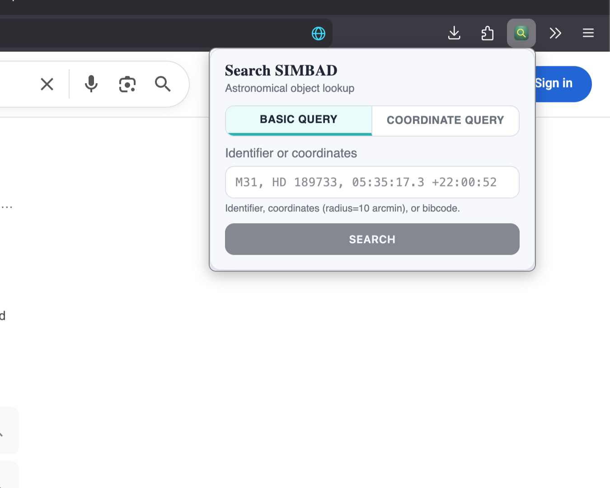
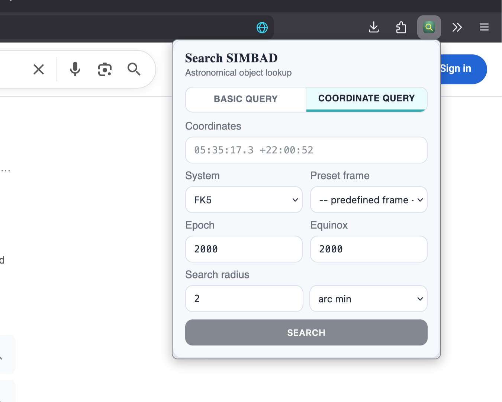
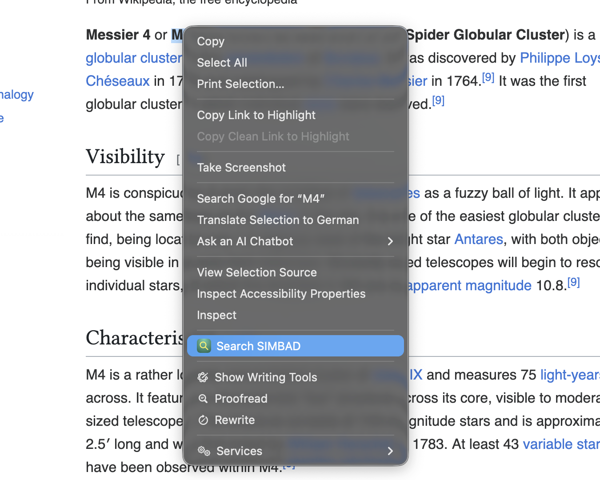

### Search SIMBAD

This is a minimalistic web browser extension that brings the [SIMBAD](https://simbad.u-strasbg.fr/simbad) search functionality to wherever you are in the browser. The extension is currently available on both Firefox as well as Chrome. 

- [Firefox store](https://addons.mozilla.org/en-US/firefox/addon/search-simbad/)
- [Chrome store](https://chromewebstore.google.com/detail/search-simbad/cbdmkamakpebceflifegibopoofjopja)

The extension can be used in multiple ways: by entering basic queries or coordinate-based queries into the popup displayed when clicking the extension icon in the browser toolbar, or by highlighting text on a webpage, right-clicking to open the context menu, and selecting the "Search SIMBAD" option.

<table border="1" cellspacing="0" cellpadding="6">
  <tr>
    <td align="center">
      
    </td>
  </tr>
</table>

<table border="1" cellspacing="0" cellpadding="6">
  <tr>
    <td align="center">
      
    </td>
  </tr>
</table>

<table border="1" cellspacing="0" cellpadding="6">
  <tr>
    <td align="center">
      
    </td>
  </tr>
</table>

> This extension uses the SIMBAD database, operated at CDS, Strasbourg, France.
